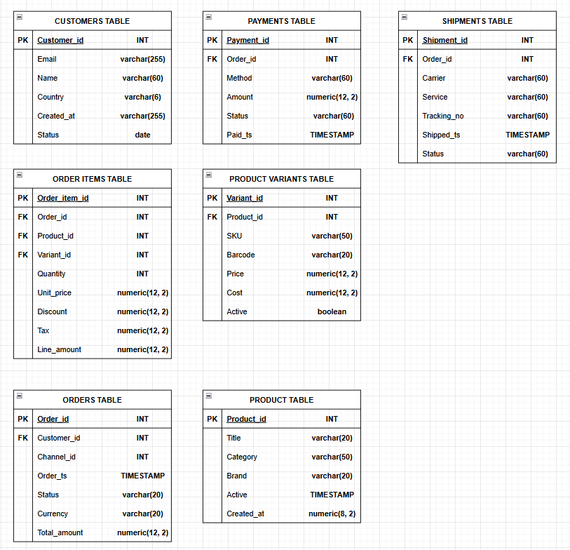
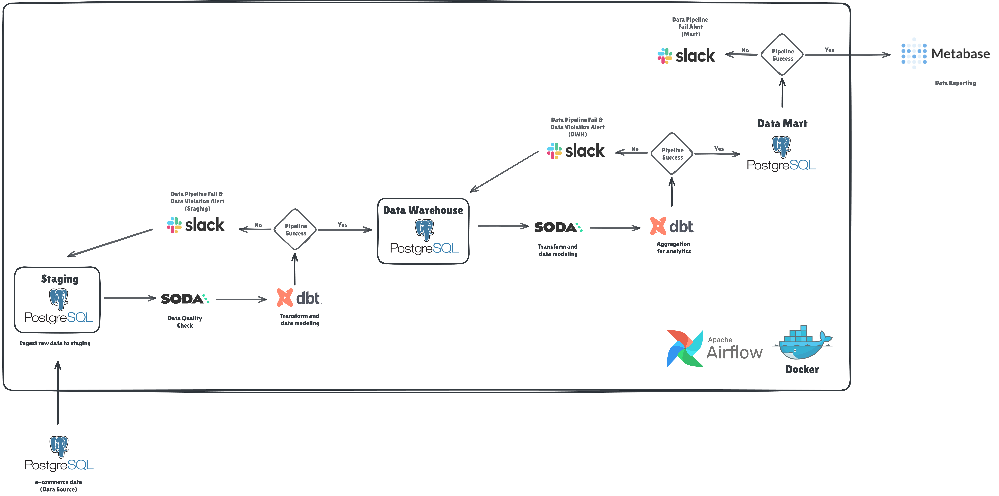

# E-commerce Automation Data Quality Check
## Introduction
E-commerce companies struggle with inconsistent reporting where revenue, order counts, and performance metrics differ across teams because each department pulls data from different systems or applies its own transformation logic. 
This results in contradicting figures at executive meetings, delays in decision-making, and a lack of faith in analytics results.
Furthermore, operational reports frequently contain missing, duplicated, or incomplete order records as a result of system faults, integration issues, or manual data entry problems, which can directly affect financial and operational performance assessments.
<br>
Logistics performance is also challenging to track precisely because shipping data is typically scattered among systems, making it harder to discover delays, failed deliveries, or bottlenecks in the fulfillment process.
Without a governed data platform that standardizes, validates, and models data consistently, the organization operates reactively, spending more time reconciling numbers than generating insights. 
This project tackles these issues by establishing a dependable data pipeline with built-in data quality controls and structured analytics layers, guaranteeing that business choices are based on accurate, consistent, and trustworthy information.

# Business Problem
Organizations often suffer from:
- 15–25% discrepancy in revenue numbers across teams
- 5–10% data errors caused by missing or duplicate records
- Delayed shipment visibility leading to customer dissatisfaction
- 30–40% analyst time spent cleaning data instead of analyzing

# Data Undestanding
The data source consists of 7 tables from operational data store (ODS).


# Project Structure
```text
E-commerce-Automation-DQC/
├─ airflow/
│  ├─ dags/
│  │  ├─ dag_create_table_oltp.py
│  │  ├─ dag_data_seed_oltp.py
│  │  ├─ dag_ingest_scan_dq_staging.py
│  │  ├─ dag_modeling_transform_dq_dwh.py
│  │  └─ dag_analytics_scan_dq_mart.py
│  │  │
├─ include/
│  ├─ soda/
│  │  ├─ soda_config.yml
│  │  ├─ staging/
│  │  │  └─ staging_checks.yml
│  │  ├─ dwh/
│  │  │  └─ dwh_checks.yml
│  │  ├─ mart/
│  │  │  ├─ mart_customer_metrics.yml
│  │  │  ├─ mart_daily_revenue.yml
│  │  │  ├─ mart_orders.yml
│  │  │  ├─ mart_product_performance.yml
│  │  │  └─ mart_shipments.yml
│  │  │
│  ├─ dbt/
│  │  ├─ models/ 
│  │  │  │  ├─ staging/
│  │  │  │  │  ├─ staging_schema.yml
│  │  │  │  │  ├─ stg_customers.sql
│  │  │  │  │  ├─ stg_order_items.sql
│  │  │  │  │  ├─ stg_orders.sql
│  │  │  │  │  ├─ stg_payments.sql
│  │  │  │  │  ├─ stg_product_variants.sql
│  │  │  │  │  ├─ stg_products.sql
│  │  │  │  │  └─ stg_shipments.sql
│  │  │  │  ├─ core/
│  │  │  │  │  ├─ dimension
│  │  │  │  │  │  ├─ dim_customers.sql
│  │  │  │  │  │  ├─ dim_dates.sql
│  │  │  │  │  │  ├─ dim_product_variants.sql
│  │  │  │  │  │  └─ dim_products.sql
│  │  │  │  │  └─ fact
│  │  │  │  │  │  ├─ fct_order_items.sql
│  │  │  │  │  │  ├─ fct_orders.sql
│  │  │  │  │  │  ├─ fct_payments.sql
│  │  │  │  │  │  └─ fct_shipments.sql
│  │  │  │  ├─ marts/
│  │  │  │  │  ├─ customer_support
│  │  │  │  │  │  └─ mart_customer_metrics.sql
│  │  │  │  │  ├─ finance
│  │  │  │  │  │  └─ mart_daily_revenue.sql
│  │  │  │  │  ├─ logistic
│  │  │  │  │  │  └─ mart_shipments.sql
│  │  │  │  │  ├─ product
│  │  │  │  │  │  └─ mart_product_performance.sql
│  │  │  │  │  └─ sales
│  │  │  │  │  │  └─ mart_orders.sql
│  │  │  │  └─ quarantine/
│  │  │  │  │  ├─ dwh/
│  │  │  │  │  │  ├─ quarantine_dim_customers.sql
│  │  │  │  │  │  ├─ quarantine_dim_dates.sql
│  │  │  │  │  │  ├─ quarantine_dim_product_variants.sql
│  │  │  │  │  │  ├─ quarantine_dim_products.sql
│  │  │  │  │  │  ├─ quarantine_fct_order_items.sql
│  │  │  │  │  │  ├─ quarantine_fct_orders.sql
│  │  │  │  │  │  ├─ quarantine_fct_payments.sql
│  │  │  │  │  │  └─ quarantine_fct_shipments.sql
│  │  │  │  │  ├─ staging/
│  │  │  │  │  │  ├─ quarantine_stg_customers.sql
│  │  │  │  │  │  ├─ quarantine_stg_order_items.sql
│  │  │  │  │  │  ├─ quarantine_stg_orders.sql
│  │  │  │  │  │  ├─ quarantine_stg_payments.sql
│  │  │  │  │  │  ├─ quarantine_stg_product_variants.sql
│  │  │  │  │  │  ├─ quarantine_stg_products.sql
│  │  │  │  │  │  └─ quarantine_stg_shipments.sql
│  │  ├─ profiles/
│  │  │  └─ profiles.yml 
│  │  ├─ seeds/
│  │  ├─ macros/
│  │  ├─ snapshots/
│  │  ├─ dbt_project.yml
│  │  ├─ packages.yml 
│  │  └─ profiles.yaml
│  │
├─ dashboards/
│  └─ metabase_export.json
│  │
├─ .gitignore
├─ .dockerignore
├─ .env-example
├─ .pre-commit-config.yaml
├─ .python-version
├─ docker-compose.yml
├─ Dockerfile
├─ requirements.txt
├─ pyproject.toml
├─ uv.lock
└─ README.md
```

# Technologies Used
- Python
- SQL
- Dbt
- Apache airflow
- PostgreSQL + DBeaver
- Soda core
- Docker & docker compose
- uv
- Slack webhooks

# Dataflow
```text
Here’s what happens operationally:
RAW ─────────► STAGING 
                  ↓
            DBT STAGING Run
                  ↓
            DBT Test STAGING
                  ↓
            Soda Staging Scan
                  ↓                                    
           ┌──── PASS ───────────────────────────────► DWH Core (dimensions & facts)
           │                                                      ↓
           │                                               DBT DWH (Dim + Fact) Run
           │                                                      ↓
           │                                               DBT Test DWH (Dim + Fact) 
           │                                                      ↓
           └──── QUARANTINE → Slack Alert → FAIL DAG       Soda DWH Core Scan
                                                                  ↓
                                                            ┌──── PASS ────────────────────────────────────► Mart
						                                    │                                                 ↓
						                                    │                                                DBT MART Run
                                                            │                                                 ↓
                                                            │                                                DBT Test MART
                                                            │                                                 ↓
                                                            └──── QUARANTINE → Slack Alert → FAIL DAG        Soda MART Core Scan
                                                                                                              ↓
                                                                                                       ┌──── PASS ────────────────────────────────────► BI / Dashboard Layer
                                                                                                       │  
                                                                                                       └──── FAIL ────►  ──────────────┐
														                                                                │ Soda Checks  │
																							                            │  (parallel)  │
														                                    						    └──────────────┘
                                                                                                                               │
                                                                                                                               └───→ Slack-Alert → FAIL DAG
```

# Architecture
## Alternative - Local


## Alternative - Cloud
(coming-soon)

# Pipeline Schedule
| Layer	       |  Schedule                 | Purpose               |
|--------------|---------------------------|-----------------------|
| **Staging**  | Every hour    	           | Operational freshness |
| **DWH**	   | Hourly after staging      | Trusted reporting     |
| **Mart**	   | Hourly after DWH	       | KPI refresh           |

# Data Quality Strategy

| Layer	       | Check Type	          | Failure Action                 |
|--------------|----------------------|--------------------------------|
| **Staging**  | Structural rules	  | Quarantine + Fail pipeline     |
| **DWH**	     | Business integrity | Quarantine + Fail pipeline     |
| **Mart**	   | KPI sanity checks	  | Fail pipeline                  |

# Key DQ KPIs
- DQ Pass Rate: Overall percentage of all Soda checks that pass across layers, serves as the single summary metric of data trustworthiness. [level: all layers]
- Data Freshness Lag (Hours): Measures the time difference between the current timestamp and the most recent record ingested, ensures data is updated within SLA (e.g., < 24 hours). [level: staging & mart]
- Completeness Ratio: Percentage of required fields populated across key tables (e.g., customer_id, order_id, payment_id); detects missing or null values. [level: staging & core/dwh]
- Uniqueness Ratio: Ratio of duplicate primary keys or rows found in critical tables to total records; indicates data duplication or faulty ingestion logic.  [level: staging]
- Business Rule Consistency: Proportion of transactions passing business logic checks (e.g., sum(payment.amount) ≈ sum(order_items.revenue)); ensures financial accuracy. [level: all layers]
- Schema Compliance: Percentage of datasets matching the expected schema (column names, data types, constraints); helps catch unexpected schema drifts. [level: staging]

# Business Impact
| Improvement	             | Expected Gain                    |
|--------------------------|----------------------------------|
| **Faster reporting**     | 50% reduction in reporting time  |
| **Data errors reduced**  | 70% fewer incidents              |
| **Decision speed**	     | 30% faster KPI availability      |
| **Analyst productivity** | +40% time on analysis            |

# How to Run This Project
## Alternative - Local
1. Clone this repo
``` bash
git clone <repo-url>
cd project
```

2. Install uv
```bash
pip install uv
```

3. Install dependencies
```bash
uv sync
```

4. Go to .env file and change all the content depending on your preference 

5. Prevent bad code before commit to repo
```bash
pre-commit install
pre-commit run --all-files
```

6. Go to subfolder to run the docker-compose 
6.1. (Optional) Before doing that, you first need to set up the permissions of two directories if you're use linux OS
```bash
cd docker-setup
sudo chmod a+rwx <project_directory>
```

6.2. Run the container
```bash
docker-compose up -d
```

6.3. Stop the container
```bash
docker-compose down -v
```

7. Accessing the database from DBeaver
<p align="center">
  
</p>
Connection:
- Host=localhost
- Database=<check_PGDATABASE_in_your_.env_file>
- Port=<check_PGPORT_in_your_.env_file>
- Click "Show all databases" checkbox
- Username=<check_PGUSER_in_your_.env_file>
- Password=<check_PGPASSWORD_in_your_.env_file>
- (Optional) Click "Save password" checkbox
- Click "Test Connection ..." button to verify db connection
- Click "OK" button

8. Orchestrating with Airflow
8.1. Access Airflow UI at -> http://localhost:8080
<p align="center">
  
</p>
8.2. Create table for raw data -> task_id: dag_create_table_oltp
<p align="center">
  
</p>
8.3. Insert raw data -> task_id: seed_bronze_data
<p align="center">
  
</p>
8.4. [Staging_layer] task_id: dag_ingest_scan_dq_staging, list of flows inside the dag:
- use dbt to materialize staging models and extraction data from raw into staging
- use dbt test to check and validate structure (include: not null, unique, relationships)
- use soda to check and validates data behavior (include: volume, duplicates, invalid values, data freshness)
- use dbt with quarantine to materialize quarantine models and isolate/moves bad rows into quarantine
<p align="center">
  
</p>
8.5. [core/dwh_layer] task_id: dag_modeling_transform_dq_dwh, list of flows inside the dag:
- use dbt to materialize dimensional models and transform data from staging into dwh
- use dbt test to check and validate structure (include: not null, unique, relationships) on dimension & fact
- use soda to check and validates data behavior (include: volume, duplicates, invalid values, data freshness) on dimension & fact
- use dbt with quarantine to materialize quarantine models and isolate/moves bad rows into quarantine
<p align="center">
  
</p>
8.5. [Mart_layer] task_id: dag_analytics_scan_dq_mart
- use dbt to materialize mart models and load result of aggregate data from dim & fact table
- use dbt test to check and validate structure (include: not null, unique, relationships)
- use soda to check and validates data behavior (include: volume, duplicates, invalid values, data freshness)
<p align="center">
  
</p>

## Alternative - Cloud
(Comming Soon)

# Production Deployment Checklist

# Data Visualization
(In-progress)

# Future enhancements
- Real-time streaming ingestion
- Data contracts per domain team
- Data catalog integration
- Separate Slack channels per layer
- ML feature store layer
- Implement DQ metrics dashboard using promotheus and grafana
